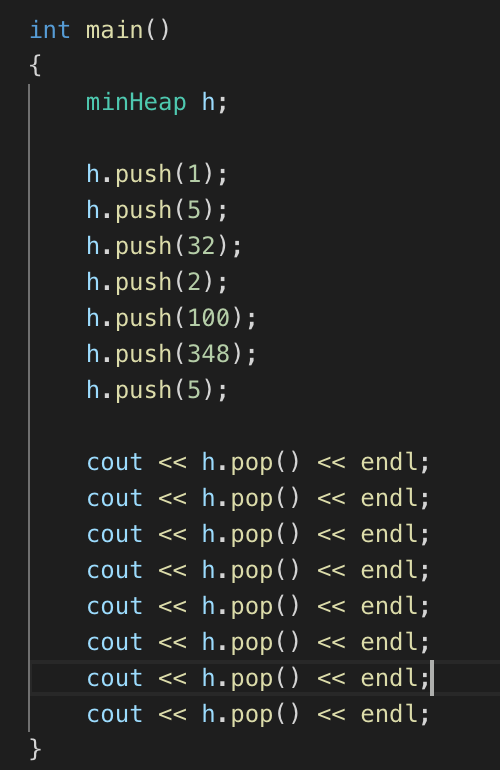
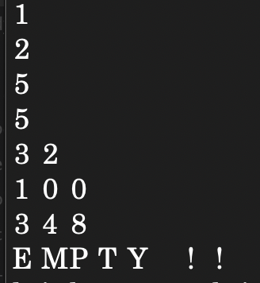

# Basic Heap

## Output




## Contents

  - [Heap](#heap)

## Heap

- 1.1 Min Heap Class

```C++
class minHeap
{
private:
    int heap[HEAP_SIZE] = {0};
    int count;

public:
    minHeap()
    {
        count = 0;
    }
    void push(int newValue)
    {
        if (count + 1 == HEAP_SIZE) // heap index start from 1. 연산 쉽게 해줄려고!
        {
            cout << "FULL !!" << endl;
            return;
        }
        else
        {
            heap[++count] = newValue;
            int cur = count;
            int parent = cur / 2;

            while (parent && heap[parent] > heap[cur]) // maxHeap이라면 부등호의 방향만 반대로 해주면 된다.
            {
                int tmp = heap[parent];
                heap[parent] = heap[cur];
                heap[cur] = tmp;
                cur = parent;
                parent = cur / 2;
            }
        }
    }
    int pop()
    {
        if (count == 0)
        {
            cout << "EMPTY !!" << endl;
            throw "error";
        }
        else
        {
            int ret = heap[1];
            heap[1] = heap[count--]; // 맨 뒤에 있는 heap data를 가져온다.
            int cur = 1;
            int child = cur * 2;    // base로 left child를 선정한다.
            if (child + 1 <= count) // right child가 있는경우
            {
                child = heap[child] < heap[child + 1] ? child : child + 1; // 더 작은 쪽의 child를 선택한다.
            }
            while (child <= count && heap[cur] > heap[child])
            {
                int tmp = heap[cur];
                heap[cur] = heap[child];
                heap[child] = tmp;

                cur = child;
                child = cur * 2;
                if (child + 1 <= count) // right child가 있는경우
                {
                    child = heap[child] < heap[child + 1] ? child : child + 1; // 더 작은 쪽의 child를 선택한다.
                }
            }

            return ret;
        }
    }
};

```